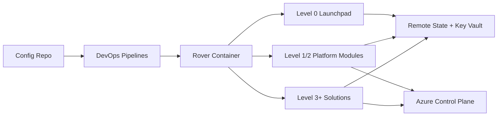
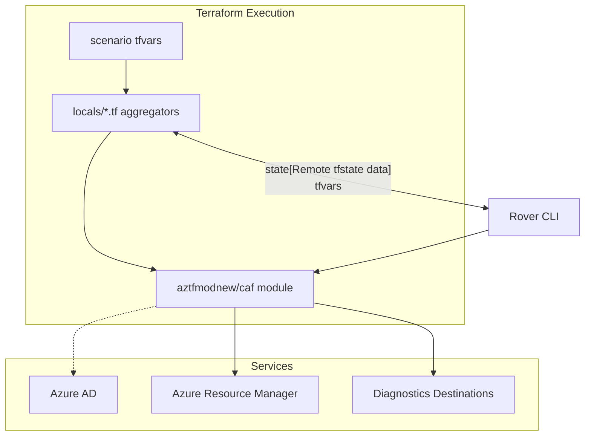
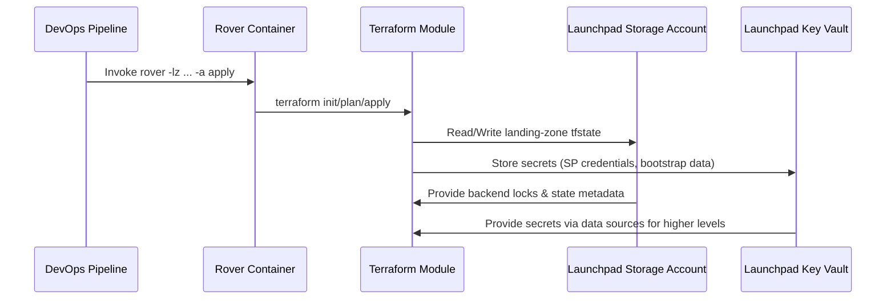

# Project Architecture Blueprint – Azure CAF Terraform Landing Zones

> Generated: 2025-11-14 UTC  
> Configuration: `PROJECT_TYPE=Auto-detect`, `ARCHITECTURE_PATTERN=Auto-detect`, `DIAGRAM_TYPE=Component`, `DETAIL_LEVEL=Comprehensive`, `INCLUDES_CODE_EXAMPLES=true`, `INCLUDES_IMPLEMENTATION_PATTERNS=true`, `INCLUDES_DECISION_RECORDS=false`, `FOCUS_ON_EXTENSIBILITY=true`

---

## 1. Architecture Detection and Analysis

### Technology stacks
- **Infrastructure as Code**: Terraform modules (`caf_launchpad`, `caf_solution`, `templates/`) driven by the `aztfmodnew/caf` module and the `aztfmodnew/azurecaf` provider.
- **Automation & Tooling**: The Rover container (Docker-based) plus Bash scripts orchestrate Terraform execution (`documentation/getting_started/getting_started.md`).
- **Pipelines**: GitHub Actions, Azure DevOps, and Terraform Cloud pipelines described in `documentation/delivery/delivery_landingzones.md` and `templates/pipelines/`.
- **Testing**: Go-based validation harnesses (`documentation/test/unit_test.md`) running through Rover.
- **Knowledge artifacts**: Markdown documentation, diagrams, and configuration templates.

### Detected architectural patterns
- **Hierarchical landing zone levels** (L0 launchpad, L1/L2 platform, L3+ workloads) enforcing separation of duties.
- **Layered modularization**: Terraform modules compose via locals, remote objects, and key-based scoping (see `caf_solution/landingzone.tf` and `local.*.tf`).
- **GitOps-driven delivery**: Code/config repo split, declarative promotion, automated validation.
- **Provider abstraction**: The azurecaf provider normalizes naming, diagnostics, and resource graph metadata.
- **Remote state federation**: `caf_launchpad` provisions secured storage and key vault per level, enabling module orchestration through tfstate references.

## 2. Architectural Overview
- **Guiding principles**: Opinionated defaults aligned with CAF, idempotent deployments, segregation of duties, and automation-first delivery via Rover.
- **Boundaries**: Each landing-zone level has isolated state backends, pipelines, and RBAC scopes. Module interfaces depend on explicit maps (e.g., `local.networking`) rather than implicit globals, preventing cross-level drift.
- **Hybrid patterns**: Combines layered IaC with plugin-like service composition—modules expose extension points (custom role definitions, diagnostics, private endpoints) that can be selectively enabled.
- **Enforcement**: Locals and validation logic ensure only allowed providers, subscription contexts, and naming templates are consumed at each level.

## 3. Architecture Visualization

### High-level subsystem map


### Component interaction focus


### Data flow snapshot (tfstate + secrets)


## 4. Core Architectural Components

### Launchpad (Level 0)
- **Purpose**: Bootstraps secure storage, key vaults, diagnostics, Azure AD apps, and optional VNet/agent infrastructure (`caf_launchpad/main.tf`, `readme.md`).
- **Internal structure**: Provider blocks pin versions; locals derive `global_settings`, `tfstates`, backend definitions, and tag conventions. Modules consume `var.launchpad_key_names` to reference generated storage/key vault artifacts.
- **Interaction**: Serves as dependency root—higher levels pull state outputs (storage account, key vault, SPNs) through `tfstates` definitions; pipelines authenticate using secrets stored here.
- **Evolution**: Scenario folders (`scenario/100`, `scenario/200`) let teams introduce new bootstrap flavors without rewriting core logic; add-ons (self-hosted agents) are separate states referencing Launchpad outputs.

### Platform landing zones (Levels 1/2)
- **Purpose**: Build enterprise shared services (identity, management, networking, security, data) by composing the upstream `aztfmodnew/caf` module (`caf_solution/landingzone.tf`).
- **Internal structure**: Each domain has `local.<domain>.tf` merging default and scenario-specific maps. `variables.<domain>.tf` define schema contracts, ensuring consistent keys.
- **Interaction**: Module invocation passes locals to `module "solution"` along with remote object handles, diagnostics settings, and `tfstates`. Providers (e.g., `azurerm.vhub`) allow cross-subscription connectivity.
- **Evolution**: Adding a service area involves new variable + local files, plus referencing them in the module call; version upgrades to `aztfmodnew/caf` happen centrally.

### Solution accelerators (Level 3+)
- **Purpose**: Opinionated workloads (AKS, App Services, analytics) deployed via `caf_solution/scenario/*` and starter repos.
- **Internal structure**: Scenario directories hold tfvars and optional overrides for local maps; they reuse the same module entry point but narrow scope to the needed service families.
- **Interaction**: Depend on tfstate outputs from platform levels via `local.remote`, `var.remote_objects`, and `var.tfstates` so that network IDs, monitoring workspaces, etc., are referenced rather than recreated.
- **Evolution**: Teams can fork scenarios, add overlays (e.g., private endpoints, diagnostics), and register them inside CI workflows.

### Rover toolchain
- **Purpose**: Provides reproducible execution environment (Docker) bundling Terraform, Azure CLI, jq, and helper scripts (`documentation/getting_started/getting_started.md`).
- **Internal structure**: `rover` repo (sibling workspace) supplies Dockerfiles, `scripts/`, and devcontainer definitions. CAF landing zones assume rover entry points (`rover -lz ...`).
- **Interaction**: Pipelines run rover commands, which mount configuration repos and feed tfvars into Terraform. Rover enforces login, subscription, and workspace conventions.
- **Evolution**: Add-ons can inject extra tooling (ansible, packer) by extending the rover image; version pinning happens via tags referenced in documentation.

### Templates and configuration assets
- **Purpose**: Provide starter pipeline YAML, Ansible playbooks, and variable scaffolding under `templates/`.
- **Internal structure**: Organized by concern (`pipelines`, `platform`, `variables`). YAML templates assume environment variables exported by Launchpad outputs.
- **Interaction**: Ops teams copy/adapt templates into their config repositories; variables feed into `caf_solution` maps.
- **Evolution**: Template updates stay backward compatible by guarding new keys with `try()` in locals.

### Documentation & governance artifacts
- **Purpose**: `documentation/` describes delivery, testing, enterprise onboarding, ensuring teams follow CAF conventions despite repo deprecation notice.
- **Interaction**: Linked from READMEs and scenario instructions; diagrams stored in `_pictures/` provide reference when customizing architecture.
- **Evolution**: Documentation sets expectations for naming, branching, and GitOps flows, reducing divergence when teams extend modules.

## 5. Architectural Layers and Dependencies
- **Layer stack**: Level 0 Launchpad → Level 1 Management/Identity → Level 2 Connectivity/Shared Resources → Level 3 Solutions → Level 4 Application landing zones.
- **Dependency rules**: Higher levels only reference lower ones through declared `tfstates` and `remote_objects`; they never manipulate lower-level resources directly, enforcing clear ownership boundaries.
- **Abstraction mechanisms**: Locals consolidate complex nested objects (see `local.networking.tf`) while `try()` plus `merge()` provide safe optionality; `coalesce()` patterns pick between inline IDs, remote references, or cross-landing-zone exports.
- **Circular dependency control**: Strict state separation plus key-based lookups prevent recursion; pipeline hierarchy ensures only upstream states can unblock downstream applies.
- **Dependency injection**: Variables such as `var.remote_objects` and `var.diagnostics_destinations` act as injection points, allowing scenarios to override defaults without editing modules.

## 6. Data Architecture
- **Domain models**: Terraform maps capture domains (networking, identity, data). Each map key equals a logical asset, carrying nested attributes for SKUs, policies, and relationships.
- **Entity relationships**: Resource groups host service instances; networking objects reference address spaces and link sets; diagnostics references event hubs/log analytics defined centrally.
- **Access patterns**: Modules mostly rely on declarative data (maps/lists). For dynamic discovery they use `data` sources (e.g., `data.azurerm_client_config.current`).
- **Transformation**: Locals transform tfvars into normalized shapes (e.g., pluralization clean-up inside `local.networking` merges `cdn_endpoint` + `cdn_endpoints`).
- **Caching**: Remote state outputs serve as authoritative cache; key vault secrets cache SP credentials for reuse. Terraform's state locking prevents concurrent mutation.
- **Validation**: azurecaf provider enforces naming constraints; pipelines require `terraform validate` and Go-based plan verification before promote.

## 7. Cross-Cutting Concerns Implementation
- **Authentication & Authorization**: Launchpad provisions Azure AD applications/service principals with defined API permissions (`caf_launchpad/readme.md`). Role assignments align to subscription scope, and pipelines often use Managed Identities.
- **Error Handling & Resilience**: Pipelines implement staged validation/plan/apply/destroy flows (`documentation/test/unit_test.md`). Terraform retries integrate with AzureRM features (e.g., `virtual_machine.graceful_shutdown`). Outages are mitigated by replaying stateful pipelines.
- **Logging & Monitoring**: Diagnostics definitions route logs to Log Analytics, Event Hubs, or storage, configurable via `diagnostics.tf` maps consumed in `caf_solution/landingzone.tf`.
- **Validation**: azurecaf_name resources plus Go tests validate naming, drift, and resource counts. Input validation occurs through variable type constraints and `try()/coalesce()` fallback logic.
- **Configuration Management**: tfvars stored per scenario; secrets centralised in Launchpad Key Vault; feature flags realized via optional map entries toggled by `enabled` booleans.

## 8. Service Communication Patterns
- **Service boundaries**: Each landing zone acts as its own service boundary with a Terraform state and pipeline. Interactions occur through exported outputs rather than direct API calls.
- **Protocols & formats**: Terraform providers call Azure Resource Manager, Azure AD Graph/Microsoft Graph, and ancillary APIs over HTTPS using Azure identities.
- **Sync vs async**: Terraform operations are synchronous but pipelines orchestrate them asynchronously via job queues. Diagnostics/event hubs enable asynchronous observability flows.
- **Versioning**: Module versions pinned in `landingzone.tf` (`version = "4.45.0"`). Remote tfstates include `level` metadata to guard against mismatched versions.
- **Discovery**: Remote object maps act as a service registry keyed by landing zone identifier; pipelines know which tfstate to read before invoking dependent deployments.
- **Resilience**: Remote backend with blob locking and optional Terraform Cloud workspaces provide eventual consistency and rollback points.

## 9. Technology-Specific Architectural Patterns
- **Terraform (primary stack)**: Modular composition via locals, scenario-based tfvars, azurecaf naming enforcement, diagnostics/private endpoint sidecars, coalesce patterns for dependency injection, and per-level remote state segregation.
- **Go (testing)**: Uses `terraform-json` for plan parsing and Azure SDK Resource Graph queries for integration validation (`documentation/test/unit_test.md`). Tests run inside Rover to share auth context.
- **Bash/Docker (Rover)**: Wrapper commands enforce login, subscription targeting, workspace selection, and mount config repos into a controlled execution container.
- **YAML (Pipelines)**: Templates in `templates/pipelines/` orchestrate plan/apply/destroy with approval gates and environment-specific variable groups.

## 10. Implementation Patterns
- **Interface design**: Modules expose maps keyed by logical names; defaults defined in `variables.<domain>.tf` and combined via locals, ensuring interface segregation between service families.
- **Service implementation**: Terraform services follow idempotent apply semantics, with lifecycle tweaks (e.g., `prevent_deletion_if_contains_resources`) to avoid destructive actions.
- **Repository pattern**: Remote state + local maps mimic repository semantics—state outputs serve as read models, locals act as write models feeding module invocations.
- **Controller/API patterns**: Rover commands behave as controllers, orchestrating plan/apply/destroy sequences per landing zone with standardized arguments.
- **Domain model**: Entities such as resource groups, VNets, identities, diagnostics destinations, and policies are modeled as Terraform objects with tags ensuring traceability.

## 11. Testing Architecture
- **Strategy**: Lint + plan validation, Go-based unit tests on plan JSON, optional integration tests deploying sample scenarios (`documentation/test/unit_test.md`).
- **Boundaries**: Unit tests run without Azure (plan inspection). Integration tests deploy to Azure and query via Resource Graph.
- **Test doubles**: Plan JSON acts as deterministic fixture; mocks for Azure Graph handled via environment variables.
- **Data strategy**: tfplan JSON stored in artifacts; env vars (`JSON_PLAN_PATH`) feed Go tests.
- **Tooling**: GitHub Actions/DevOps pipelines call `go test`, `terraform validate`, and `terraform_with_var_files` helper scripts.

## 12. Deployment Architecture
- **Topology**: Rover container executes within developer machines or CI agents; remote state stored in launchpad-created storage + key vault; optional Terraform Cloud backend supported via `backend.remote` locals.
- **Environment adaptations**: Scenario folders differentiate dev/test/prod via tfvars; pipelines parameterize workspace names and subscriptions.
- **Runtime dependencies**: Providers require Azure CLI/AAD auth; pipelines set `ARM_*` env vars or use Managed Identity. Diagnostics require Log Analytics/Event Hub instances defined in L1.
- **Containerization**: Dev Containers and Rover images hold Terraform binaries; Docker volumes store plugin caches for reproducibility.
- **Cloud integration**: Launchpad ensures necessary infra (storage, key vault, log analytics) exists before higher levels run.

## 13. Extension and Evolution Patterns
- **Feature additions**: Introduce new service families by adding `variables.<domain>.tf`, `local.<domain>.tf`, wiring them into `module "solution"`, and documenting tfvars templates. Keep inputs optional via `try()` to avoid breaking existing scenarios.
- **Safe modifications**: Use feature flags and staged pipelines (plan-only PRs, manual apply) to validate changes. Maintain backward compatibility by preserving key names even when refactoring internal structures.
- **Integration**: External systems integrate via remote objects or by consuming tfstate outputs (e.g., security tooling hooking into diagnostics). Adapter modules translate third-party requirements into CAF-compliant maps.
- **Migration approach**: Deploy parallel landing zone versions with new tfstate keys, slowly repoint workloads, then retire old states to minimize downtime.

## 14. Architectural Pattern Examples

### Launchpad provider and locals (from `caf_launchpad/main.tf`)
```terraform
provider "azurerm" {
  partner_id = "ca4078f8-9bc4-471b-ab5b-3af6b86a42c8"
  features {
    key_vault {
      purge_soft_delete_on_destroy = var.provider_azurerm_features_keyvault.purge_soft_delete_on_destroy
    }
    resource_group {
      prevent_deletion_if_contains_resources = var.provider_azurerm_features_resource_group.prevent_deletion_if_contains_resources
    }
  }
}

locals {
  landingzone_tag = { "landingzone" = var.landingzone.key }
  tags = merge(local.global_settings.tags, local.landingzone_tag, { "caf_environment" = local.global_settings.environment })
  tfstates = tomap({ (var.landingzone.key) = local.backend[var.landingzone.backend_type] })
}
```
*Demonstrates*: provider hardening, global tagging, backend injection via locals.

### Domain map normalization (from `caf_solution/local.networking.tf`)
```terraform
locals {
  networking = merge(
    var.networking,
    {
      cdn_endpoint = merge(var.cdn_endpoint, var.cdn_endpoints)
      virtual_hubs = var.virtual_hubs
      private_dns  = var.private_dns
      vnets        = var.vnets
    }
  )
}
```
*Demonstrates*: defensive merging of legacy/plural inputs plus consolidated networking contract.

### Module orchestration (from `caf_solution/landingzone.tf`)
```terraform
module "solution" {
  source  = "aztfmodnew/caf/azurerm"
  version = "4.45.0"

  networking        = local.networking
  diagnostics       = local.diagnostics
  remote_objects    = local.remote
  tfstates          = var.tfstates
  current_landingzone_key = try(var.landingzone.key, var.landingzone[var.backend_type].key)
  providers = { azurerm.vhub = azurerm.vhub }
}
```
*Demonstrates*: single entry point passing curated locals, remote references, and provider aliases.

## 15. Architecture Governance
- **Standards**: azurecaf naming, required diagnostics, and tag inheritance enforced in code. Documentation provides conventions for repo structure and GitOps flows.
- **Automated checks**: `terraform validate`, `terraform plan`, Go tests, and optional `terraform_with_var_files` wrapper enforce syntax and behavioral expectations. Pipelines require approval before apply/destroy.
- **Reviews**: PR-based workflows plus manual approvals inside Azure DevOps/Azure RBAC ensure segregation of duties per landing zone level.
- **Documentation**: Markdown references under `documentation/` and scenario READMEs keep architecture knowledge current; diagrams highlight workflows.

## 16. Blueprint for New Development
- **Workflow**: Start by updating Launchpad (if needed) to ensure new secrets/storage exist. Branch per landing zone scenario, add or adjust tfvars under `caf_solution/scenario/*`, run `terraform_with_var_files plan`, submit PR with plan artifact, then apply via controlled pipeline.
- **Component templates**: Use the existing `variables.<domain>.tf` files as schema references; extend locals with `merge()` and wrap new attributes in `try()`; register diagnostics/private endpoints using the standard blocks provided in modules.
- **Dependency declaration**: When referencing cross-level assets, add entries to `var.tfstates`/`var.remote_objects` rather than hardcoding IDs. Document new keys in scenario README.
- **Testing**: Always run plan + Go unit tests locally via Rover before pushing. For new service families, create a minimal scenario tfvars to act as regression coverage.
- **Pitfalls**: Avoid mixing level responsibilities within one state, ensure azurecaf prefixes are not duplicated in names, and never bypass Launchpad secrets with ad-hoc credentials. Watch for provider version drift—`module "solution"` pins CAF version, so coordinate upgrades.
- **Currency**: Record blueprint generation date (above) and review quarterly to capture module upgrades, Azure API changes, and organizational policy updates.

---

This blueprint consolidates the observable architecture within `/home/fdr001/source/github/aztfmodnewnew/caf-terraform-landingzones` as of the generation date to guide consistent maintenance and future enhancements.
